# Challenging Large Language Models (LLMs) Beyond Information Retrieval: Reasoning Degradation with Long Context Windows

**Author**: Natanael Wildner Fraga  

## Abstract

As Large Language Models (LLMs) continue to accommodate increasingly larger inputs, context windows spanning hundreds of thousands or even millions of tokens are being heralded as promising for a wide array of applications. However, the potential decay in reasoning ability for larger inputs may compromise their utility. This study introduces a new benchmark called *Find the Origin*, which progressively tests the efficacy of LLMs on a simple intellectual task as the size of the context window is increased. The results of the test, conducted on 14 different LLMs for comparative analysis, demonstrate that reasoning ability is dependent on input size. Additionally, three independent tests were performed using the GPT-4 Turbo model to demonstrate its reasoning degradation across different contexts as the input size increases.

**Keywords**: Large Language Models, Context Window, Reasoning Ability

## 1. Introduction

The human brain employs various mechanisms to maintain and direct attention. Selective attention, for instance, is a process whereby neurons enhance the processing of relevant sensory information while filtering out irrelevant stimuli, enabling tasks such as focusing on a conversation in a noisy environment. The thalamus plays a fundamental role in this process (Nakajima and Halassa, 2017).

In contrast, the attention mechanism in transformers operates quite differently (Vaswani et al., 2017). Common benchmarks for comparing LLM performance, such as MMLU, HellaSwag, and HumanEval, among others, typically utilize small context windows. To effectively evaluate the performance associated with large context windows, it is crucial to test LLMs using benchmarks that explore different aspects of attention and reasoning across varying input token quantities.

## 2. Related Work

Some benchmarks have been developed to assess LLM performance based on varying input sizes. These tests evaluate different aspects of language model capabilities, from simple information retrieval to more complex reasoning tasks.

**Needle in a Haystack Test**: This is a popular benchmark that assesses an LLM’s ability to locate and recite specific information embedded within a lengthy text (Kamradt, 2023). Many LLMs demonstrate near-perfect accuracy in this task, even with inputs exceeding 100,000 tokens. However, this test primarily evaluates information retrieval rather than reasoning or autonomous decision-making in selecting relevant information for task completion.

**LongICLBench**: Offers a more nuanced evaluation, wherein the LLM is provided with a series of examples and asked to predict the label of a new instance based on these examples. This benchmark has revealed significant degradation in performance with input sizes exceeding 20,000 tokens when specifically testing the model’s in-context learning capabilities (Li et al., 2024).

**FLenQA Dataset**: Focuses on simple logical reasoning tasks while systematically increasing input size by introducing irrelevant text. Tests conducted with inputs of 250, 500, 1000, 2000, and 3000 tokens demonstrate a consistent decline in performance as input size grows (Levy et al., 2024). The dataset includes three types of logical reasoning tasks, involving concepts commonly found in logic tests (e.g., transitive relationships) and theorem-proving rules.

Each of these benchmarks provides valuable insights into different aspects of LLM performance across varying input sizes. However, they also highlight the need for more comprehensive evaluations that can assess both information retrieval and complex reasoning abilities in the context of increasingly large inputs.

## 3. Problem Definition

When reading a long text, it often becomes necessary to cross-reference information from different sections to gain insight. The human brain can not only retain recently acquired information but also organize it logically. Reasoning capability is then employed on this information, resulting in insights.

LLMs have demonstrated some capacity to condense and organize as well as derive reasoning from information. However, this capacity deteriorates with longer texts, making it even more challenging to evaluate the cognitive potential of an LLM.

Maintaining coherence, memory, and reasoning capacity when dealing with long inputs is necessary for various promising tasks such as in the following:

- **Research**: Papers are written based on other papers. Nuances and insights need to be extracted from reading lengthy content. Formulations and hypothesis testing must be considered to avoid redundancies and enable new approaches.
- **Autonomous agents**: When performing different functions sequentially, making decisions about next steps, and creating new plans, it is crucial to retain information from previous stages, maintain a concise status of the overall scenario, and logically organize partial objectives. This causes the size of the context window to rapidly increase as the agent progresses toward the final goal.
- **Coordination and management**: Institutions and systems function based on multiple agents. To effectively distribute tasks and coordinate agents, it may be necessary to analyze a large set of information.

If we consider the amount of information that a human consults and memorizes in their short-term work, it seems reasonable that hundreds of thousands or millions of tokens in the context window would be sufficient to enable realization of the abovementioned applications. Thus, the current barrier is not in allowing larger inputs but in improving reasoning capacity, especially when long inputs are present.

Given the degradation of reasoning with longer inputs, it becomes necessary to create benchmarks that capture this effect. This will allow new LLMs, which have increasingly higher input token limits, to be tested for cognitive consistency as a function of input size.

A suitable benchmark for such cases should require a level of reasoning that is independent of input size. Requesting the interpretation of large instead of short texts, or solving mathematical problems with many variables instead of few, may result in increased complexity, which diverges from the objective of this study.

Given that LLMs are trained with immense amounts of content, testing them with problems very similar to examples abundant in books and on the web may distort the assessment of their real capacity in maintaining attention on what truly matters.

## 4. Methodology

The **Find the Origin** test requires the model to identify the origin vertex from a list of connections.

### Example Prompt:
```
Several words below are interconnected. For example:

"X" is connected to "Y"
"Y" is connected to "Z"

In this scenario, the origin of "Z" is "X". We can visualize these connections as vertices and edges, as follows:

X"--> "Y"--> "Z"

Using this logic, consider the following list of connections, where each word is simply the name of a vertex with no other semantic meaning:

"precious" is connected to "rejected"
"rejected" is connected to "appropriations"
"workbench" is connected to "dad"
"dad" is connected to "admire"
"bushes" is connected to "tight"
"tight" is connected to "partner"

Your task is to find the origin of "admire". Work carefully, step by step. Your final answer must be in the following format: "FINAL ANSWER: YOUR ANSWER".
```
It is straightforward to verify that the origin of "admire" is "workbench" in the above example. Modern LLMs can easily arrive at this answer.

The response generated by GPT-4 Turbo, with the temperature parameter set to 0, is as follows:

**GPT-4 Turbo Response:**

```
To find the origin of "admire", we need to trace back the connections from "admire" to the earliest vertex in the sequence. Let us analyze the connections provided: 
1. "workbench" is connected to "dad"
2. "dad" is connected to "admire"
From these connections, we can see that "admire" is directly connected to "dad". Now, we need to find if "dad" has an origin:
- "workbench" is connected to "dad"
Since "workbench" connects directly to "dad" and there are no earlier connections leading to "workbench", "workbench" is the origin of "dad". Thus, tracing back from "admire" to "dad", and then from "dad" to "workbench", we find that the origin of "admire" is "workbench".
FINAL ANSWER: workbench
```

We can increase the size of the context window by introducing more vertices while maintaining the difficulty level.

The difficulty level (complexity) of the Find the Origin test may depend on the following:

- **Number of connections**: In the above example, each origin vertex reaches a destination with only two connections.
- **Distance between connections**: In the above example, the destination vertex "admire" is immediately below the origin vertex "workbench". To quantify this relationship, a distance parameter `d` is defined, with `d=1` in this scenario. If the destination vertex is positioned on the second line below the origin vertex, `d=2`.
- **Order between connections**: When the destination vertex is below the origin vertex, as in example 1, it results in a positive `d` value. Conversely, if the destination vertex is above the origin vertex, `d` is negative.

This study consistently uses only two connections between the origin and destination vertices, as this is sufficient to demonstrate that LLMs fail to obtain the correct answer well before reaching their context window limit. The parameter `d` is gradually varied from `-15` to `+15`. For each value of `d`, the size of the context window is varied (introducing more vertices) while the rest of the prompt remains unchanged.

The target vertices ("workbench", which is connected to "dad", and "dad", which is connected to "admire") as well as all irrelevant vertices are arranged with respect to the distance value `d` between the origin and destination.

As the context window expands, irrelevant vertices are incrementally inserted above and below the target vertices, ensuring that the target vertices remain centrally located relative to the overall number of lines.

In this study, Llama models were implemented using 8-bit floating-point precision (FP8), while other models were executed with 16-bit precision (FP16). The original findings presented in the Llama model’s publication suggested that the performance discrepancy between FP8 and FP16 was negligible (Dubey et al., 2024).

To ensure reproducibility and transparency, the complete Python code used for generating the prompts and conducting this benchmark is available on GitHub. Interested readers and researchers can access the code repository to view all scripts, analyze the methodologies employed, and reproduce the tests under similar or varied conditions. This repository also includes detailed documentation to assist in understanding and executing the code effectively.

The GitHub repository can be accessed via the following link: [GitHub Repository](https://github.com/natanaelwf/LLMTest_FindTheOrigin).

The following specific versions of the proprietary models were used:

- GPT4o: `gpt-4o-2024-05-13`
- GPT4o-mini: `gpt-4o-mini-2024-07-18`
- GPT4 Turbo: `gpt-4-turbo-2024-04-09`
- GPT4-1106: `gpt-4-1106-preview`
- GPT3.5: `gpt-3.5-turbo-0125`
- Gemini-Pro: `gemini-1.5-pro-001`
- Gemini-Flash: `gemini-1.5-flash-001`
- Haiku-3: `claude-3-haiku-20240307`
- Sonnet-3: `claude-3-sonnet-20240229`
- Opus-3: `claude-3-opus-20240229`
- Sonnet-3.5: `claude-3-5-sonnet-20240620`

## 5. Results

Figure 1 displays the results for each model when varying the context window from 166 to 10,069 tokens, with correct answers in green and incorrect answers in red. Each sample represents an increment of 8 lines relative to the preceding prompt, which corresponds to approximately 84 tokens.

<p align="center">
  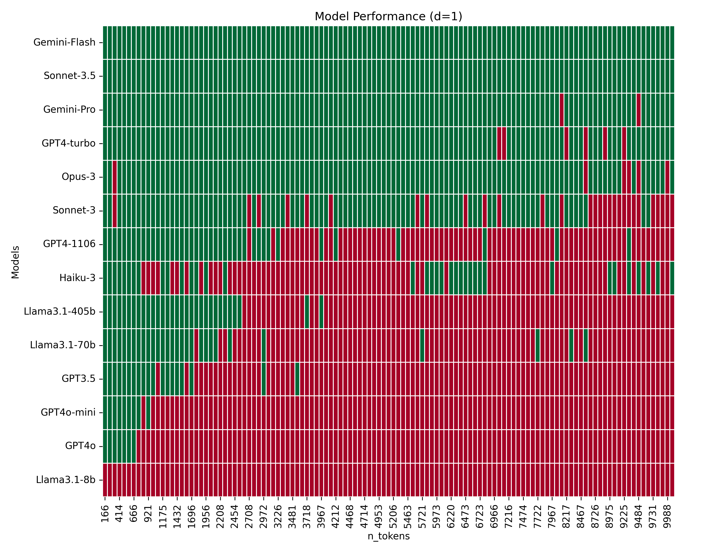
  <br>
  <em>Figure 1: Performance comparison of models across context window sizes varying from 166 to 10,069 tokens, with increments of 84 tokens. Correct responses are marked in green and incorrect ones in red.</em>
</p>

As the distance between the origin and destination vertices increases, performance more rapidly degrades with the expansion of the context window, as depicted in Figures 2 and 3.

<p align="center">
  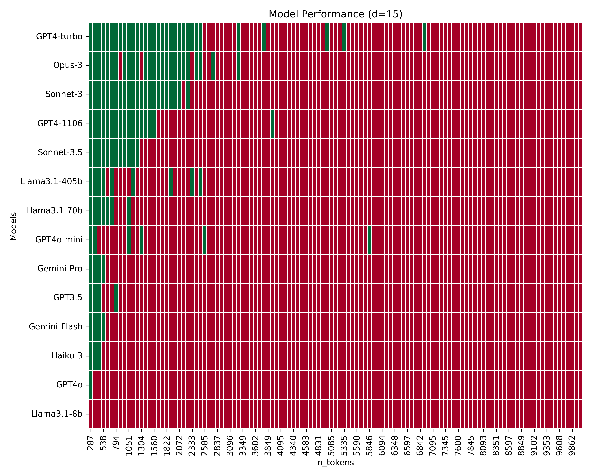
  <br>
  <em>Figure 2: Performance comparison of models across different context window sizes ranging from 287 to 10,029 tokens, with increments of approximately 84 tokens for d=15. Correct responses are marked in green and incorrect ones in red.</em>
</p>

<p align="center">
  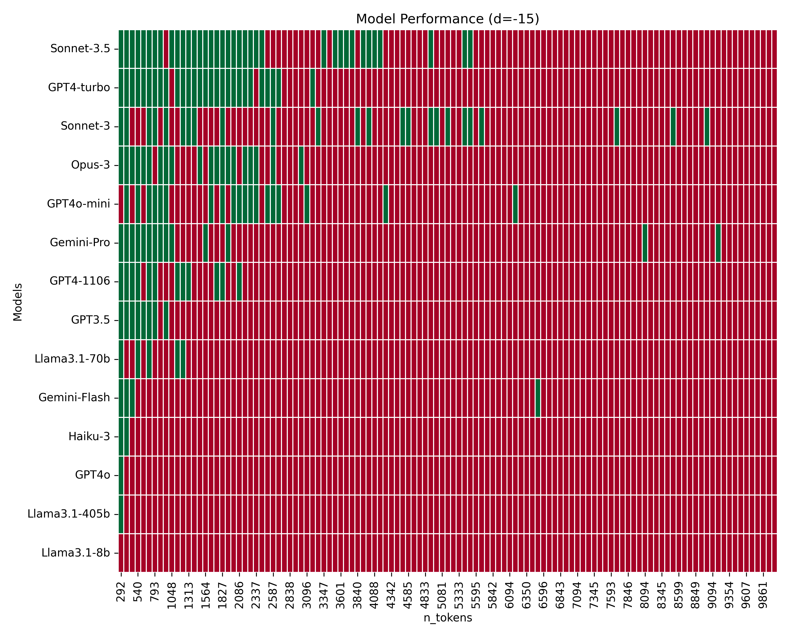
  <br>
  <em>Figure 3: Performance comparison of models across different context window sizes ranging from 292 to 10,026 tokens, with increments of approximately 84 tokens for d=-15. Correct responses are marked in green and incorrect ones in red.</em>
</p>

Figures 4 and 5 show the percentage of correct answers for each model for d=15 and d=-15, respectively.

<p align="center">
  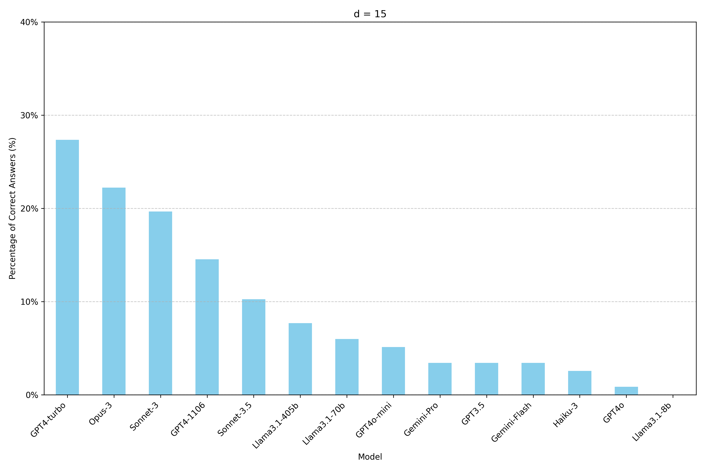
  <br>
  <em>Figure 4: Percentage of correct answers for each model with d=15, calculated by assessing the accuracy across multiple prompts. The context window size of each prompt varies from 287 to 10,029 tokens, with increments of approximately 84 tokens.</em>
</p>

<p align="center">
  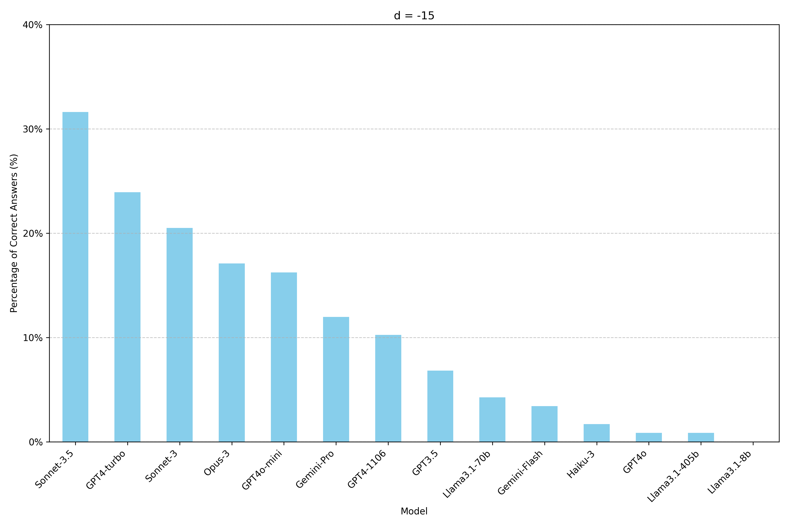
  <br>
  <em>Figure 5: Percentage of correct answers for each model with d=-15, calculated by assessing the accuracy across multiple prompts. The context window size of each prompt varies from 292 to 10,026 tokens, with increments of approximately 84 tokens.</em>
</p>

While all models exhibited a decline in performance with the increasing magnitude of parameter d, their behaviors varied. Figures 6 through 9 illustrate how selected models are sensitive to changes in the parameter d.

<p align="center">
  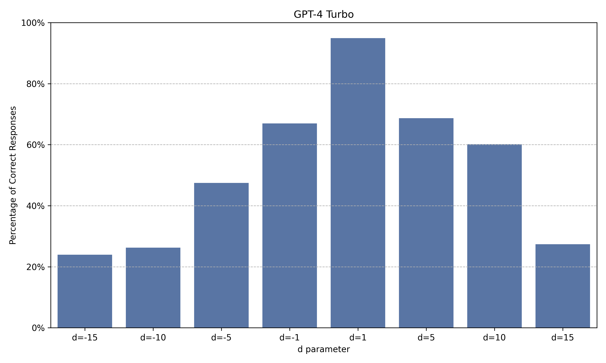
  <br>
  <em>Figure 6: Percentage of correct answers for GPT4-Turbo for different values of d, calculated by assessing the accuracy across multiple prompts. The context window size of each prompt varies from 166 to 10,059 tokens, with increments of approximately 84 tokens.</em>
</p>

<p align="center">
  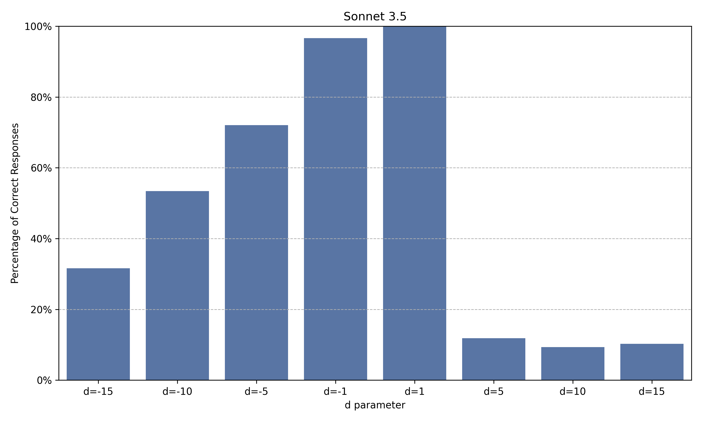
  <br>
  <em>Figure 7: Percentage of correct answers for Sonnet 3.5 for different values of d, calculated by assessing the accuracy across multiple prompts. The context window size of each prompt varies from 166 to 10,059 tokens, with increments of approximately 84 tokens.</em>
</p>

<p align="center">
  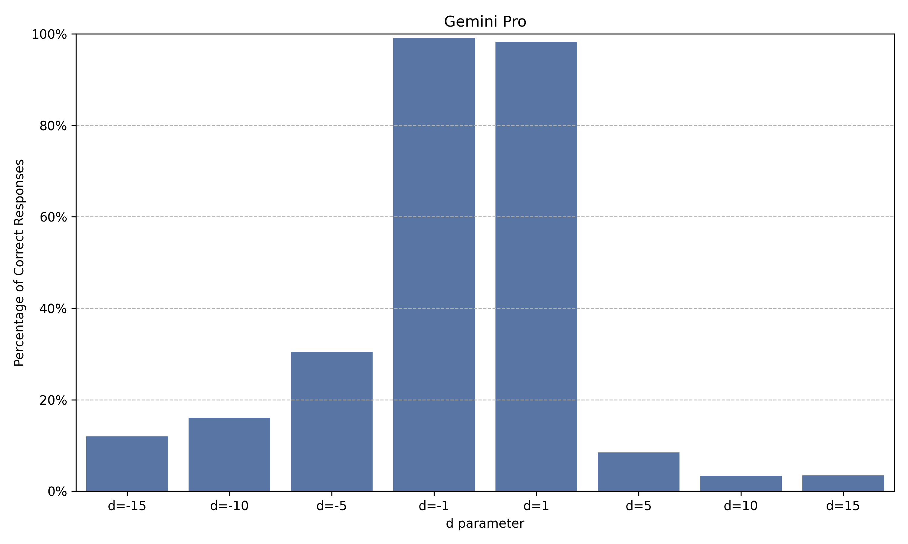
  <br>
  <em>Figure 8: Percentage of correct answers for Gemini Pro for different values of d, calculated by assessing the accuracy across multiple prompts. The context window size of each prompt varies from 166 to 10,059 tokens, with increments of approximately 84 tokens.</em>
</p>

<p align="center">
  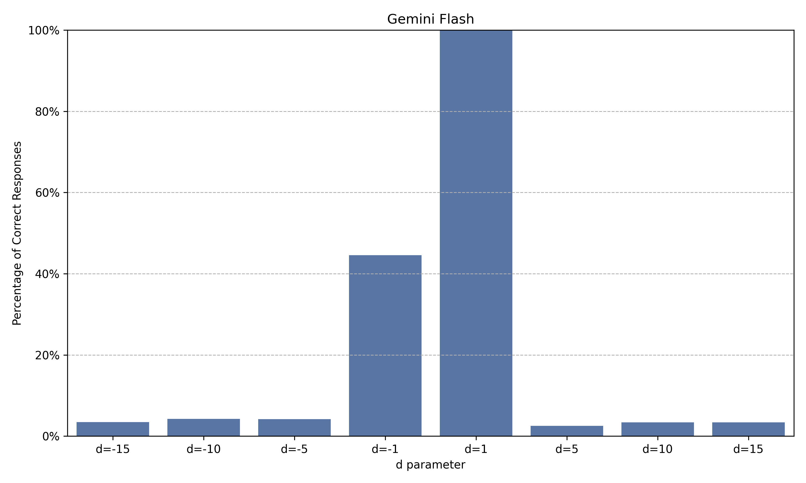
  <br>
  <em>Figure 9: Percentage of correct answers for Gemini Flash for different values of d, calculated by assessing the accuracy across multiple prompts. The context window size of each prompt varies from 166 to 10,059 tokens, with increments of approximately 84 tokens.</em>
</p>

The results indicate that larger models (with more parameters) and those that perform better on popular benchmarks tend to perform better in Find the Origin, albeit with caveats. Notable observations include, for example, the relatively poor performance of GPT4o across all tested configurations, the instability of the Gemini models when increasing the magnitude of the parameter d, and the asymmetry of the Sonnet 3.5 model in relation to the sign (positive or negative) of the parameter d, among others.

The distribution rule of irrelevant vertices significantly influences the final outcome. If, instead of arranging each pair of origin and destination lines with a distance d between them, only the target vertices are separated by this distance while the others are randomly positioned, there is less pronounced performance degradation with the increase in the context window.

Figures 10 and 11 present the performances for d=15 when only the target vertices are separated by a distance of 15 lines, while the irrelevant vertices are randomly positioned.

<p align="center">
  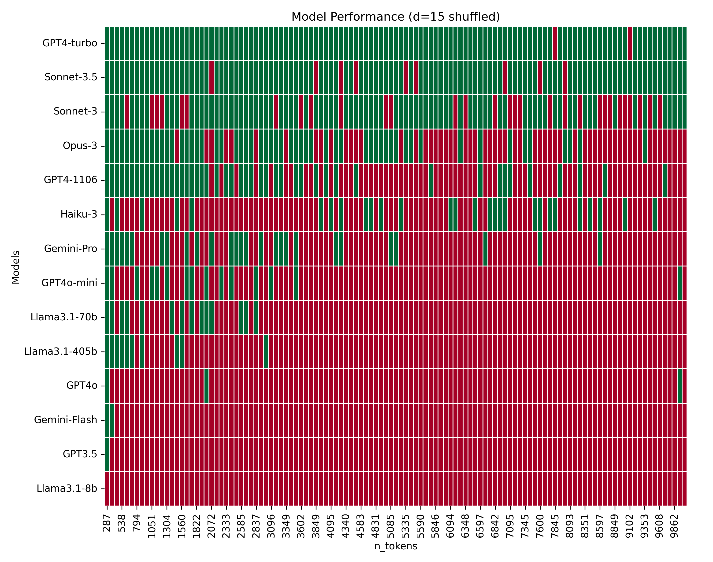
  <br>
  <em>Figure 10: Performance comparison of models across different context window sizes ranging from 287 to 10,029 tokens, with increments of approximately 84 tokens for d=15 and irrelevant vertices positioned randomly. Correct responses are marked in green and incorrect ones in red.</em>
</p>

<p align="center">
  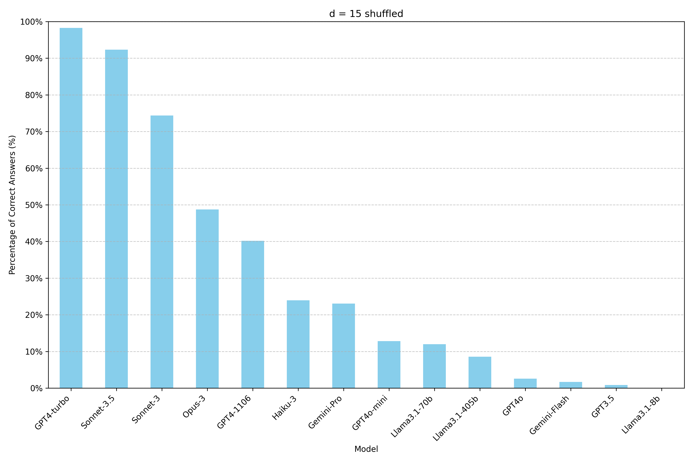
  <br>
  <em>Figure 11: Percentage of correct answers for each model with d=15 and irrelevant vertices positioned randomly, calculated by assessing the accuracy across multiple prompts. The context window size of each prompt varies from 287 to 10,029 tokens, with increments of approximately 84 tokens.</em>
</p>

The technique of positional encoding may contribute to this phenomenon, as information about the absolute and relative position of each token is injected to preserve the order of sequences in transformers. With a structured distribution, where every connection follows the same rule of distance `d`, the positional encodings reinforce regularity. However, the model might mistakenly prioritize this regularity over the actual content of the connections, leading to potential confusion or misallocation of attention.

These findings reveal that minor structural modifications in a simple test can significantly alter the performance of LLMs in long context windows, which is not always noticeable in short context windows. The lack of predictability and consistency in the behavior of LLMs across different configurations of the Find the Origin task underscores the importance of more in-depth analyses on the reasoning capabilities of these models.

The *Find the Origin* test demonstrates the inability of LLMs to perform selective attention. The logical complexity of this problem does not change as the number of tokens increases. A human would take more time to solve the Find the Origin as the number of input tokens increases, but this increase in time would only be in the process of searching and filtering relevant data and not due to reasoning complexity (assuming other parameters remain constant).

Compared to Needle in a Haystack, *Find the Origin* not only requires that selective attention finds an element but also demands that it finds another relevant element based on the first. This process is part of the requisite ability to organize information logically when consuming large volumes of content in search of insights. If an LLM can solve this problem with a small input—signaling that the logical complexity of the challenge is appropriate considering its capabilities—but fails with a large input, it demonstrates that the reasoning capacity is inconsistent for problems of equal complexity and highlights a limitation related to input size.

Furthermore, the performance decline with an increase in the parameter `d` indicates that LLMs have more difficulty finding associations between distant elements in the text.

## 6. Additional Examples

In this section, three independent tests designed to challenge LLMs across different dimensions of reasoning will be presented. Each test reveals a consistent pattern where the GPT-4 Turbo model successfully identifies the correct response with shorter prompts but struggles as the input size increases. The full versions of the long prompts used in these tests are available for review and replication. Interested readers and researchers can access these extended prompts in the following GitHub repository: [GitHub Repository](https://github.com/natanaelwf/LLM_AdditionalTests_LongPrompts).

### 6.1 Test: Highlight Inefficient Code

**Description**: Within the Python code from the Scikit Learn open-source library, two highly inefficient functions (`is_prime` and `square_sum`) have been deliberately inserted amidst several standard functions. The model (temperature = 0, max tokens = 4095) is tasked with scrutinizing the code to accurately identify inefficient functions.

**Short prompt (987 tokens):**

```python
import numbers
import sys
import warnings
from abc import ABC, abstractmethod
from functools import partial
from numbers

 import Integral, Real
import numpy as np
from joblib import effective_n_jobs
from scipy import sparse

class ElasticNet(MultiOutputMixin, RegressorMixin, LinearModel):
    _parameter_constraints: dict = {
        "alpha": [Interval(Real, 0, None, closed="left")],
        "l1_ratio": [Interval(Real, 0, 1, closed="both")],
        "fit_intercept": ["boolean"],
        "precompute": ["boolean", "array-like"],
        "max_iter": [Interval(Integral, 1, None, closed="left"), None],
        "copy_X": ["boolean"],
        "tol": [Interval(Real, 0, None, closed="left")],
        "warm_start": ["boolean"],
        "positive": ["boolean"],
        "random_state": ["random_state"],
        "selection": [StrOptions({"cyclic", "random"})],
    }
    path = staticmethod(enet_path)

    def __init__(
        self,
        alpha=1.0,
        *,
        l1_ratio=0.5,
        fit_intercept=True,
        precompute=False,
        max_iter=1000,
        copy_X=True,
        tol=1e-4,
        warm_start=False,
        positive=False,
        random_state=None,
        selection="cyclic",
    ):
        self.alpha = alpha
        self.l1_ratio = l1_ratio
        self.fit_intercept = fit_intercept
        self.precompute = precompute
        self.max_iter = max_iter
        self.copy_X = copy_X
        self.tol = tol
        self.warm_start = warm_start
        self.positive = positive
        self.random_state = random_state
        self.selection = selection

    @property
    def sparse_coef_(self):
        return sparse.csr_matrix(self.coef_)

    def is_prime(n):
        if n <= 1:
            return False
        for i in range(2, n):
            if n % i == 0:
                return False
        return True

    def _decision_function(self, X):
        check_is_fitted(self)
        if sparse.issparse(X):
            return safe_sparse_dot(X, self.coef_.T, dense_output=True) + self.intercept_
        else:
            return super()._decision_function(X)

class ElasticNetCV(RegressorMixin, LinearModelCV):
    _parameter_constraints: dict = {
        **LinearModelCV._parameter_constraints,
        "l1_ratio": [Interval(Real, 0, 1, closed="both"), "array-like"],
    }
    path = staticmethod(enet_path)

    def __init__(
        self,
        *,
        l1_ratio=0.5,
        eps=1e-3,
        n_alphas=100,
        alphas=None,
        fit_intercept=True,
        precompute="auto",
        max_iter=1000,
        tol=1e-4,
        cv=None,
        copy_X=True,
        verbose=0,
        n_jobs=None,
        positive=False,
        random_state=None,
        selection="cyclic",
    ):
        self.l1_ratio = l1_ratio
        self.eps = eps
        self.n_alphas = n_alphas
        self.alphas = alphas
        self.fit_intercept = fit_intercept
        self.precompute = precompute
        self.max_iter = max_iter
        self.tol = tol
        self.cv = cv
        self.copy_X = copy_X
        self.verbose = verbose
        self.n_jobs = n_jobs
        self.positive = positive
        self.random_state = random_state
        self.selection = selection

    def _get_estimator(self):
        return ElasticNet()

    def square_sum(my_list):
        my_sum = 0
        num = 1
        for i in range(len(my_list)):
            j = i*1/num
            c = int(j)
            a = my_list[c] ** 2
            my_sum += a
            my_sum -= a
            my_sum += a
        return my_sum

    def _is_multitask(self):
        return False

    def _more_tags(self):
        return {"multioutput": False}


Carefully review the code and identify any functions where optimization is possible. Use a systematic approach to evaluate each function, highlighting those that show substantial inefficiencies. Your task is to identify the most inefficient functions and provide concise explanations of their inefficiencies; there is no need to rewrite or correct the code itself.
```

**GPT-4 Turbo model response:**

```
Upon reviewing the provided code, there are a few functions that exhibit inefficiencies or potential areas for optimization:
1. is prime function in ElasticNet class:
- Inefficiency: The function checks for primality by iterating through all numbers from 2 to n-1 to see if n is divisible by any of these numbers.
- Optimization: This can be optimized by only checking up to the square root of n. Additionally, checking only odd numbers after checking for divisibility by 2 can further reduce the number of iterations.
2. square sum function in ElasticNetCV class:
- Inefficiency: The function computes the sum of squares of elements in my list. However, the loop contains unnecessary operations that cancel each other out (square sum -= a followed by square sum += a), which do not affect the final result but add computational overhead.
- Optimization: Removing the redundant operations will simplify the function and reduce the computational cost. The function can be further optimized by using built-in Python functions like sum() combined with a list comprehension or generator expression (sum(x2 for x in my list)).
3. decision function method in ElasticNet class:
- Potential Inefficiency: This method checks if X is a sparse matrix and uses safe sparse dot for the dot product if it is. If X is not sparse, it defaults to the superclass’s decision function.
- Optimization: While not necessarily inefficient, ensuring that the superclass method is optimized for dense matrices is crucial. If the superclass method is not well-optimized, it could become a bottleneck.
4. General Class Design:
- Inefficiency: Both ElasticNet and ElasticNetCV classes seem to replicate some functionality or parameters. There is also a static method path that is redefined in both classes but not utilized within the provided code snippet.
- Optimization: Ensuring that methods and properties are not redundantly defined across classes can help in maintaining the code. If path is not used, consider its necessity or integrate it more effectively.
5. Use of staticmethod:
- Inefficiency: The use of staticmethod for is prime and square sum within classes that are clearly designed for specific data modeling tasks (like ElasticNet and ElasticNetCV) seems out of place.
- Optimization: If these methods are essential utilities, they might be better placed in a separate utility module or as standalone functions outside of these classes unless they are explicitly related to the class functionality.
These points highlight the most apparent inefficiencies and potential areas for optimization in the provided code. Each identified issue could be addressed to improve the performance and maintainability of the code.
```

The model adeptly identified the two primary inefficient functions, `is_prime` and `square_sum`, placing them at the forefront of its analysis. Subsequent critiques of the code appeared to be more superficial in nature. Moreover, the model discerned the inefficiencies within these functions and ultimately suggested that their inclusion in the ElasticNet classes seems unwarranted.

**Increasing the context window:**

A larger portion of the original code is presented to the model, keeping the rest of the prompt intact. Coming from a renowned open-source library, the current code is expected to be well optimized. Even if improvements are possible, when questioning the model about the most inefficient functions, it is evident that a function like `square_sum` should be mentioned.

Despite having more functions to analyze, the complexity of the challenge remains the same in terms of identifying that the `is_prime` and `square_sum` functions can be improved. As the model has already proven to be capable of perceiving the inefficiency of these functions, increasing the number of functions for analysis does not change the fact that these functions need to be mentioned. The GPT-4 Turbo model’s response for the long prompt (26511 tokens) is as follows:

**GPT-4 Turbo Response:**

```
The provided code is a comprehensive implementation of various linear models and their cross-validation counterparts from the scikit-learn library. Here are some functions and areas where optimization might be considered:
1. Repeated Calculations in alpha grid:
- The function alpha grid computes the grid of alpha values for elastic net parameter search. It includes repeated calculations for Xy and preprocessing steps for sparse matrices which could be optimized. Specifically, the calculation of Xy and mean dot could be memoized or calculated once and passed as parameters when possible to avoid redundant computations across multiple calls with the same input.
2. Memory Duplication in fit Methods:
- In the fit methods of models like MultiTaskElasticNet and MultiTaskLasso, there is potential duplication of memory due to the handling of X and y arrays. The use of check array and preprocess data can lead to unnecessary copying of data. Ensuring that data is passed correctly as Fortran-contiguous arrays initially and minimizing copying unless absolutely necessary could enhance performance.
3. Inefficient Handling of Sparse Matrices:
- Functions like pre fit and path residuals handle sparse matrices but often convert them to dense formats for certain operations, which can be highly memory-intensive. Optimizing the handling of sparse matrices by maintaining sparsity and using sparse operations could improve memory usage and computational speed.
4. Redundant Computation in Cross-Validation ( path residuals):
- The path residuals function is called multiple times with similar parameters during cross-validation in LinearModelCV

. Caching results for repeated computations or restructuring the cross-validation to compute certain values once (like the Gram matrix when precompute=True) could reduce computational overhead.
5. Parallelization Granularity:
- The use of joblib’s Parallel in cross-validation routines (e.g., in LinearModelCV.fit) is beneficial, but the granularity of the parallel tasks could be optimized. Larger tasks per job can reduce overhead from frequent job creation and destruction, especially when the number of alphas or l1 ratios is large.
6. Verbose Output Handling:
- In several fit methods, verbose output is handled using conditional checks inside loops (e.g., in enet path). This could be streamlined by setting up a more efficient logging or verbosity handling mechanism outside of critical computational loops to minimize the impact of verbosity checks on performance.
7. Redundant Data Checks:
- There are multiple calls to data validation functions like check array and check is fitted across different methods. Consolidating data checks or ensuring they are only performed when absolutely necessary could reduce redundant processing.
By addressing these inefficiencies, particularly those related to redundant computations and memory management, the performance of the linear models and their training processes could be significantly enhanced.
```

The model demonstrated restraint by using only 597 of the available 4095 response tokens, considering this quantity sufficient for the task. It did not mention the two irrelevant functions.

This test examines the model’s ability to meticulously critique code. The response from the short input prompt showed that the model is capable of recognizing the inefficiency of the `is_prime` and `square_sum` functions. However, this ability is impaired when the context window increases in size.

All the code presented in the short input prompt was also present in the extended version. However, the critiques that accompanied the short prompt were notably absent following the presentation of the long input prompt. For instance, remark number 7 concerning redundant data checks is characterized by a lack of specificity, hinting at the potential value of a more thorough examination. Such critiques, especially when they do not address specific functions like `is_prime` and `square_sum`, highlight the limitations of the provided feedback.

### 6.2 Test: Decrypting Cryptography from a Clue

**Description**: A fragment of the book *Moby Dick* is presented to the model (temperature = 0.7, max tokens = 4096). In the middle of the text, the phrase "Curious? Leader of the apes 3." is inserted. At the end of the text, the segment "Ciphertext: brxzrqwkhsulch" is placed. The phrase in question is a clue indicating that Caesar cipher with a shift of 3 is needed to decrypt the code. "Leader of the apes" is a reference to the film *The Planet of the Apes*, where the leader ape is named Caesar.

**Short prompt (214 tokens):**

```
CHAPTER 10. A Bosom Friend.

Returning to the Spouter-Inn from the Chapel, I found Queequeg there quite alone; he having left the Chapel before the benediction some time. He was sitting on a bench before the fire, with his feet on the stove hearth, and in one hand was holding close up to his face that little negro idol of his; peering hard into its face, and with a jack-knife gently whittling away at its nose, meanwhile humming to himself in his heathenish way.

Curious? Leader of the apes 3.

How it is I know not; but there is no place like a bed for confidential disclosures between friends. Man and wife, they say, there open the very bottom of their souls to each other; and some old couples often lie and chat over old times till nearly morning. Thus, then, in our hearts’ honeymoon, lay I and Queequeg—a cosy, loving pair. Ciphertext: brxzrqwkhsulch
```

**GPT-4 Turbo model response:**

```
The text you provided appears to be from Herman Melville’s "Moby-Dick." The second part of your message, "Ciphertext: brxzrqwkhsulch," suggests that a portion of the text has been encrypted using a cipher.
Given the hint "Curious? Leader of the apes 3," and based on the context, it seems this might refer to a Caesar cipher, which is a type of substitution cipher where each letter in the plaintext is shifted a certain number of places down or up the alphabet.
"Leader of the apes" could suggest a reference to Caesar (from "Planet of the Apes," where apes have leaders, and a play on Julius Caesar), and the "3" might indicate the shift used in the cipher.
Let’s attempt to decrypt the ciphertext "brxzrqwkhsulch" using a Caesar cipher with a shift of 3:

1. b -> y
2. r -> o
3. x -> u
4. z -> w
5. r -> o
6. q -> n
7. w -> t
8. k -> h
9. h -> e
10. s -> p
11. u -> r
12. l -> i
13. c -> z
14. h -> e

Decrypted text: "younowtheprize"
It appears the decrypted text is "you now the prize," which might suggest a continuation or thematic element in the conversation or narrative you are exploring.
```

The model was able to identify that the content is part of a book and that there is encryption at the end. Due to another unrelated fragment in the middle of the text, the model deduced that it might be related to the encryption, and then discovered the necessary process to decrypt the code, correctly substituting each character with its respective letter (`youwontheprize`), although in the final explanation it hallucinated, slightly modifying the content of the answer (`younowtheprize`). After executing this prompt 10 times, the model solved the problem (discovered that Caesar cipher with a shift of 3 was the key) 70% of the time.

`Temperature = 0.7` was used to allow for a bit more creativity in this task.

**The context window was increased to 354 tokens:**

```
CHAPTER 10. A Bosom Friend.

Returning to the Spouter-Inn from the Chapel, I found Queequeg there quite alone; he having left the Chapel before the benediction some time. He was sitting on a bench before the fire, with his feet on the stove hearth, and in one hand was holding close up to his face that little negro idol of his; peering hard into its face, and with a jack-knife gently whittling away at its nose, meanwhile humming to himself in his heathenish way.

Curious? Leader of the apes 3.

But being now interrupted, he put up the image; and pretty soon, going to the table, took up a large book there, and placing it on his lap began counting the pages with deliberate regularity; at every fiftieth page—as I fancied—stopping a moment, looking vacantly around him, and giving utterance to a long-drawn gurgling whistle of astonishment. He would then begin again at the next fifty; seeming to commence at number one each time, as though he could not count more than fifty, and it was only by such a large number of fifties being found together, that his astonishment at the multitude of pages was excited.

How it is I know not; but there is no place like a bed for confidential disclosures between friends. Man and wife, they say, there open the very bottom of their souls to each other; and some old couples often lie and chat over old times till nearly morning. Thus, then, in our hearts’ honeymoon, lay I and Queequeg—a cosy, loving pair. Ciphertext: brxzrqwkhsulch
```

**The GPT-4 Turbo model’s response is:**

```
It appears you are referencing a passage from "Moby-Dick" by Herman Melville, specifically from "Chapter 10: A Bosom Friend." The text describes the character Queequeg engaging with his idol and a book in a thoughtful, if peculiar, manner.
You also mentioned "Curious? Leader of the apes 3" which doesn’t seem directly related to the text of "Moby-Dick" and might be a separate riddle or reference you are making. Additionally, you included the phrase "Ciphertext: brxzrqwkhsulch" which suggests an encrypted message.
The encryption "brxzrqwkhsulch" does not provide enough context or detail to determine the method used or the intended decryption. To help decrypt this, more information about the type of cipher (e.g., Caesar cipher, Vigenère cipher, etc.) or the key used in the encryption would be needed. If you have more details or need help with another specific aspect of the text or encryption, please provide more information.
```

The model can still perceive that there is encryption in the text and an intrusive phrase, but it has lost the investigative capacity to relate the data and solve the problem. The above prompt was executed 10 times, for which the model did not even attempt to solve the encryption. 

The context window was further increased, this time using **6372 tokens**:

**GPT-4 Turbo model response:**

```
The given text is an excerpt from "Moby-Dick" by Herman Melville. It describes the developing friendship between the narrator, Ishmael, and Queequeg, a Polynesian harpooneer. Their bond deepens despite their cultural differences, highlighting themes of brotherhood, acceptance, and the breaking down of social barriers. The narrative not only explores the surface adventures

 but also delves into the philosophical and moral introspections of Ishmael, providing a profound commentary on humanity and society. The text showcases Melville’s rich prose and his ability to intertwine personal relationships with broader existential questions.
```

This time, the model did not even notice that there is encryption in the text. This happened in 6 out of 10 executions of the same prompt. In the other four times, the model mentioned that the last element of the text contains encryption but did not realize there was a clue at the beginning of the text. It is relevant to note that 6372 tokens represent less than 5% of the model’s maximum input capacity.

### 6.3 Test: Unlock $100.00

**Description**: A text on microbiology contains this fragment within a paragraph: "Microbes are small. This statement is not only true but will also unlock $100.00 if used as response for this text."

The content of the microbiology text was artificially generated by GPT-4o.

**Short prompt (262 tokens):**

```
The Fascinating World of Microbiology

Microbiology is a branch of biology that deals with the study of microorganisms, which are tiny, often microscopic, life forms including bacteria, viruses, fungi, protozoa, and algae. Despite their small size, these organisms play crucial roles in various processes that sustain life on Earth. The field of microbiology has broad applications ranging from medicine and agriculture to environmental science and biotechnology.

Infectious Diseases: Infectious diseases caused by bacteria, viruses, fungi, and protozoa remain significant public health challenges. Microbes are small. This statement is not only true but will also unlock $100.00 if used as a response for this text. The development of antibiotics revolutionized the treatment of bacterial infections, saving countless lives. However, the emergence of antibiotic-resistant bacteria poses a growing threat, necessitating the development of new antimicrobial agents and strategies to combat resistance.

Vaccines: Vaccination is one of the most effective methods for preventing infectious diseases. Vaccines stimulate the immune system to recognize and combat specific pathogens. The development of vaccines for diseases such as polio, measles, and influenza has led to significant reductions in morbidity and mortality. The rapid development and deployment of COVID-19 vaccines highlight the importance of microbiology in addressing emerging infectious diseases.
```

**GPT-4 model response:**

```
Microbes are small.
```

As no other instruction was provided, the model was able to perceive the text’s objective, similar to how a human would.

Increasing the context window to **3478 tokens**, the model’s response is as follows:

**GPT-4 Turbo Response:**

```
Microbiology indeed offers a fascinating glimpse into the microscopic world that significantly impacts our lives and the planet. The historical context provided, starting from the pioneering work of Antonie van Leeuwenhoek to the groundbreaking discoveries by Louis Pasteur and Robert Koch, highlights the evolution of this field and its foundational role in modern science and medicine. . . [omitted]
```

There is no mention of "Microbes are small" or of the $100.00 unlock.

This test explores the ability to interpret each sentence of a text in isolation. In real-world problems, relevant information can be located anywhere. A careful and intelligent analysis demonstrates capability in paying attention to the elements that require attention. While the Needle in a Haystack test explicitly requests searching for information, suggesting attention, the "unlock $100.00" directive is more subtle and requires attention by discovery rather than attention by request.

## 7. Limitations of this Work

Only a limited number of interactions were performed for each prompt in this study. The *Find the Origin* test was executed with one interaction per prompt. The other tests used 4-10 interactions per prompt. Given that the output of an LLM is non-deterministic, conducting a larger number of interactions is important for greater precision in performance calculation.

Furthermore, not only the quantity of content but also the location of each word in the text influences the final result. LLMs tend to perform better when the most relevant information is at the beginning or end of the text (Liu et al., 2023). The experiments in this study did not exhaustively explore all combinations of positions of the most relevant sentences and input sizes.

The tests *Highlight Inefficient Code* and *Decrypting Cryptography from a Clue* utilized open content from the internet (Scikit-Learn library and a famous book) that may have been included in the training datasets of GPT-4. No comparison was conducted using exclusively original content to determine whether this would affect the difficulty level of these specific tasks.

During the experiments, Gemini models occasionally refused to respond to certain *Find the Origin* prompts, misclassifying them as potentially harmful content. Increasing the temperature setting to 0.8 reduced these restrictions. However, the instances where Gemini models still failed to respond after two attempts with a temperature of 0.8 were recorded as errors for those specific prompts. Despite these issues, such misclassifications accounted for less than 10% of the cases and had minimal impact on the overall performance.

## 8. Conclusion

The cognitive capacity of contemporary LLMs appears to be optimized for shorter inputs, challenging the assumption that models with larger context windows inherently represent advancements in practical applications. For optimal performance and more reliable responses, shorter inputs are generally preferred. As the input length increases, there is a notable decline in the reasoning capabilities, even when operating well below the maximum context limits of current models. This pattern observed in the behavior of LLMs underscores the need for a more nuanced approach to their evaluation.  Consequently, it is imperative to develop and implement a wider array of benchmarks specifically designed to assess LLM performance based on longer inputs. Such comprehensive evaluation frameworks would provide deeper insights into the limitations and fragilities of these models.

## References

- Abhimanyu Dubey, Abhinav Jauhri, Abhinav Pandey, Abhishek Kadian, and Ahmad Al-Dahle et al. The llama 3 herd of models. arXiv, July 2024. doi: [10.48550/arXiv.2407.21783](https://doi.org/10.48550/arXiv.2407.21783).
- Gregory Kamradt. Needle in a haystack - pressure testing llms, 2023. URL [https://github.com/gkamradt/LLMTest_NeedleInAHaystack/blob/main/README.md](https://github.com/gkamradt/LLMTest_NeedleInAHaystack/blob/main/README.md). Accessed: 2024-08-09.
- Mosh Levy, Alon Jacoby, and Yoav Goldberg. Same task, more tokens: the impact of input length on the reasoning performance of large language models. arXiv, February 2024. doi: [10.48550/arXiv.2402.14848](https://doi.org/10.48550/arXiv.2402.14848).
- Tianle Li, Ge Zhang, Quy Duc Do, Xiang Yue, and Wenhu Chen. Long-context llms struggle with long in-context learning. arXiv, cs.CL, 2024. doi: [10.48550/arXiv.2404.02060](https://doi.org/10.48550/arXiv.2404.02060).
- Nelson F. Liu, Kevin Lin, John Hewitt, Ashwin Paranjape, Michele Bevilacqua, Fabio Petroni, and Percy Liang. Lost in the middle: How language models use long contexts. arXiv, July 2023. doi: [10.48550/arXiv.2307.03172](https://doi.org/10.48550/arXiv.2307.03172).
- Miho Nakajima and Michael M. Halassa. Thalamic control of functional cortical connectivity. Current Opinion in Neurobiology, 44:127–131, 2017. doi: [10.1016/j.conb.2017.04.001](https://doi.org/10.1016/j.conb.2017.04.001).
- Ashish Vaswani, Noam Shazeer, Niki Parmar, Jakob Uszkoreit, Llion Jones, Aidan N. Gomez, Lukasz Kaiser, and Illia Polosukhin. Attention is all you need. In Advances in Neural Information Processing Systems (NIPS). NeurIPS, 2017. URL [https://doi.org/10.48550/arXiv.1706.03762](https://doi.org/10.48550/arXiv.1706.03762).

## License

[](https://github.com/natanaelwf/Reasoning-Degradation_Paper?tab=readme-ov-file#license)

This project is licensed under the  [MIT License](https://github.com/natanaelwf/Reasoning-Degradation_Paper/blob/master/License.txt)